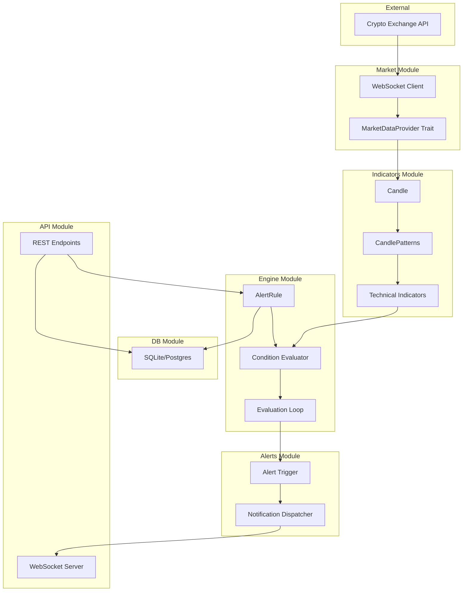

# CCT Trading Alert System Implementation Plan

## Current State

You have the foundational indicator infrastructure in place:

- [candle.rs](src/indicators/candle.rs) - OHLCV struct with true range calculation
- [candle_patterns.rs](src/indicators/candle_patterns.rs) - Candle collection with ATR indicator
- [timeframe.rs](src/indicators/timeframe.rs) - Timeframe enum (M1 to W1)
- Placeholder modules: `alerts/`, `api/`, `db/`, `engine/`, `market/`

## Architecture Overview




## Phase 1: Extend Indicators

Add essential technical indicators to `src/indicators/`:

- **SMA/EMA** - Moving averages (new file: `moving_averages.rs`)
- **RSI** - Relative Strength Index (new file: `rsi.rs`)
- **Add timestamp to Candle** - Required for time-based logic

Key changes to existing code:

```rust
// candle.rs - add timestamp field
pub struct Candle {
    timestamp: u64,  // Unix timestamp in seconds
    open: f64,
    high: f64,
    low: f64,
    close: f64,
    volume: f64,
}
```

---

## Phase 2: Market Data Module

Implement `src/market/` to connect to exchange APIs:

- `**provider.rs**` - Define `MarketDataProvider` trait
- `**binance.rs**` - Binance WebSocket implementation (well-documented API)
- `**symbol.rs**` - Trading pair representation (e.g., BTC/USDT)

Dependencies needed: `tokio`, `tokio-tungstenite`, `serde`, `serde_json`

---

## Phase 3: Alert Rule Engine

Implement `src/engine/` - the core of the application:

- `**condition.rs**` - Define condition types:

```rust
pub enum Condition {
    PriceCrossesAbove { value: f64 },
    PriceCrossesBelow { value: f64 },
    IndicatorAbove { indicator: IndicatorType, threshold: f64 },
    IndicatorBelow { indicator: IndicatorType, threshold: f64 },
    IndicatorCrossover { fast: IndicatorType, slow: IndicatorType },
}
```

- `**rule.rs**` - AlertRule struct combining conditions
- `**evaluator.rs**` - Logic to evaluate conditions against market data
- `**runner.rs**` - Main event loop subscribing to market data and triggering alerts

---

## Phase 4: Alerts Module

Implement `src/alerts/`:

- `**alert.rs**` - Alert struct (what gets created when conditions are met)
- `**dispatcher.rs**` - Send alerts to connected clients via WebSocket

---

## Phase 5: Database Persistence

Implement `src/db/`:

- `**schema.rs**` - Table definitions
- `**repository.rs**` - CRUD operations for rules and alert history

Tables: `alert_rules`, `alert_history`

Dependencies: `sqlx` with SQLite feature (simple to start)

---

## Phase 6: Web API

Implement `src/api/`:

- `**routes.rs**` - REST endpoints:
  - `POST /rules` - Create alert rule
  - `GET /rules` - List rules
  - `DELETE /rules/{id}` - Delete rule
  - `GET /alerts` - Alert history
- `**websocket.rs**` - Real-time alert push to clients

Dependencies: `axum`, `tower`

---

## Dependency Summary

Add to `Cargo.toml`:

```toml
tokio = { version = "1", features = ["full"] }
tokio-tungstenite = "0.21"
serde = { version = "1", features = ["derive"] }
serde_json = "1"
sqlx = { version = "0.7", features = ["runtime-tokio", "sqlite"] }
axum = "0.7"
uuid = { version = "1", features = ["v4"] }
```

